# TCP/IP 4계층 모델
## 2.2.1 계층 구조  
TCP/IP 계층은 네 개의 계층을 가지고 있으며 OSI 7계층과 많이 비교된다.

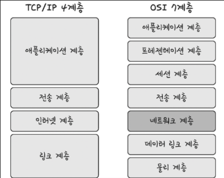  
TCP/IP : OSI 계층에서 애플리케이션, 프레젠테이션, 세션 3계층을 애플리케이션 계층으로 표현하고 데이터링크, 물리 계층 2계층을 링크 계층으로 표현한다.  
이 계층들은 특정 계층이 변경되었을 때, 다른 계층이 영향을 받지 않도록 설계되어있다.
예를들어서 전송 계층에서 TCP를 UDP로 변경했다고 해서 인터넷 웹 브라우저를 다시 설치해야 하는
것이 아니듯 유연하게 설계되어진 계층들이다.

### 애플리케이션 계층
응용 프로그램이 사용되는 프로토콜 계층이며, 웹 서비스, 이메일 등 서비스를 실질적으로 사람들에게 제공하는 층
> - FTP
>   - 장치와 장치 간의 파일을 전송하는 데 사용되는 표준 통신 프로토콜
> - SSH
>   - 보안되지 않은 네트워크에서 네트워크 서비스를 안전하게 운영하기 위한 암호화 네트워크 프로토콜
> - HTTP
>   - World Wide Web 을 위한 데이터 통신의 기초이자 웹 사이트를 이용하는 데 쓰는 프로토콜
> - SMTP
>   - 전자 메일 전송을 위한 인터넷 표준 통신 프로토콜
> - DNS
>   - 도메인 이름과 IP 주소를 매팽해주는 서버   

### 전송계층
- 송신자와 수신자간 신뢰성 있는 데이터 전송을 담당한다
- 종단(Host)의 구체적인 목적지(Process)까지 데이터가 도달할 수 있도록 한다. (Process-To-Process Communication)
- Process를 특정하기 위한 주소로 Port Number를 이용한다.
- 신뢰성 있는 데이터 전송을 위해 분할과 재조합, 연결제어, 흐름제어, 오류제어, 혼잡제어를 수행한다.  

주요 프로토콜로 TCP, UDP가 있다.  
|프로토콜 종류|TCP|UDP|
|-|-|-|
|**연결방식**|연결형 서비스|비연결형 서비스|
|**패킷 교환 방식**|가상 회선 방식|데이터그램 방식|
|**전송 순서**|전송 순서 보장|전송 순서가 바뀔수 있음|
|**수신 여부 확인**|수신 여부 확인|수신 여부 확인하지 않음|
|**통신방식**|1:1 통신|1:1 or 1:N or N:N 통신|
|**신뢰성**|높다|낮다|
|**속도**|느리다|빠르다|    

### 가상회선 패킷 교환 방식  
각 패킷에 가상회선 식별자가 포함되며 모든 패킷을 전송하면 가상회선이 해제되고 패킷들은 전송된 '순서대로' 도착하는 방식

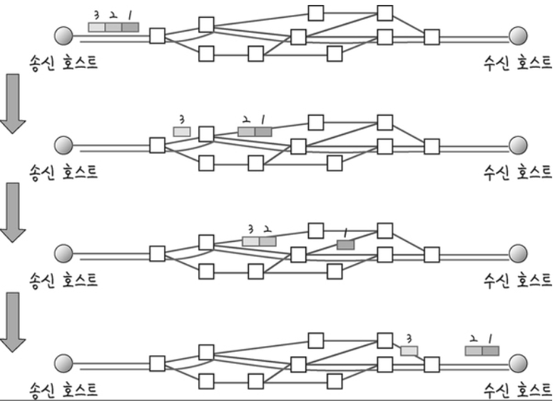

### 데이터그램 패킷 교환 방식
패킷이 독립적으로 이동하며 최적의 경로를 선택하여 가는데, 하나의 메시지에서 분할된 여러 패킷은 서로 다른 경로로 전송될 수 있으며 도착한 '순서가 다를 수'있는 방식

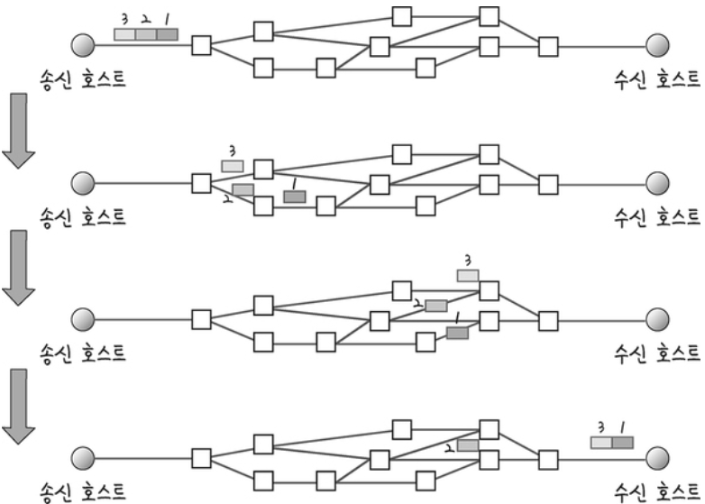

### 가상회선 vs 데이터그램
정해진 시간 안이나 다량의 데이터를 연속으로 보낼 때는 가상 회선 방식이 적합.
짧은 메시지의 일시적인 전송에는 데이터그램 방식이 적합.  
네트워크 내의 한 노드가 다운되면 데이터그램 방식은 다른 경로를 새로 설정하지만,
가상회선 방식은 그 노드를 지나는 모든 가상회선을 잃게 된다.

### TCP 연결 성립 과정  
TCP는 신뢰성을 확보할 때 '3-웨이 핸드셰이크(3-way handshake)' 라는 작업을 진행한다.

1. **SYN 단계** : 클라이언트는 서버에 클라이언트의 ISN을 담아 SYN을 보냅니다. ISN은 새로운 TCP 연결의 첫 번째 패킷에 할당된 임의의 시퀸스 번호를 말하며 이는 장치마다 다를 수 있다. 
    >**ISN**  
Initial Sequence Number의 약어, 초기 네트워크 연결을 할 때 할당된 32비트 고유 시퀸스 번호  

2. **SYN + ACK 단계** : 서버는 클라이언트의 SYN을 수신하고 서버의 ISN을 보내며 승인번호로 클라이언트의 ISN+1을 보낸다.
3. **ACK 단계** : 클라이언트는 서버의 ISN+1한 값인 승인번호를 담아 ACK를 서버에 보낸다.

3-way handshake 과정 이후 신뢰성이 구축되고 데이터 전송을 시작한다.  
TCP는 이 과정이 존재하기 때문에 신뢰성이 있는 계층이라고 하며, UDP는 이 과정이 없기 때문에 신뢰성이 없는 계층이다. 

> **State 정보**  
>- CLOSED : 포트가 닫힌 상태  
>- LISTEN : 포트가 열린 상태로 연결 요청 대기 중  
>- SYN_RECV : SYNC 요청을 받고 상대방의 응답을 기다리는 중  
>- ESTABLISHED : 포트 연결 상태  

>**Flag 정보**   
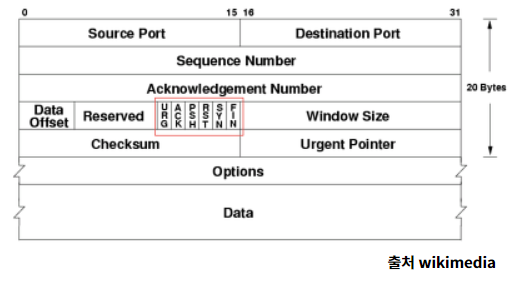
>TCP Header에는 CONTROL BIT(플래그 비트, 6bit)가 존재하며, 각각의 bit는 "URG-ACK-PSH-RST-SYN-FIN"의 의미를 가진다.  
**SYN(Synchronize Sequence Number)**  
연결 요청. Sequence Number를 랜덤으로 설정하여 세션을 연결하는 데 사용하며, 초기에 Sequence Number를 전송한다.
따라서, Connection을 생성할때 사용하는 flag이다.  
**ACK(Acknowledgement)**  
응답 확인. 패킷을 받았다는 것을 의미하는 flag이다.  
Acknowledgement Number 필드가 유효한지를 나타낸다.  
양단 프로세스가 쉬지 않고 데이터를 전송한다고 가정하면 최초 연결 설정 과정에서 전송되는 첫 번째 세그먼트를 제외한 모든 세그먼트의 ACK 비트는 1로 지정된다고 생각할 수 있다.  
**FIN(Finish)**  
연결 해제. 세션 연결을 종료시킬 때 사용되며, 더 이상 전송할 데이터가 없음을 의미한다.
4way handshake에서 사용한다.

### TCP연결 해제 과정
TCP가 연결을 해제할 때는 4-웨이 핸드셰이크(4-way handshake) 과정이 발생한다.  
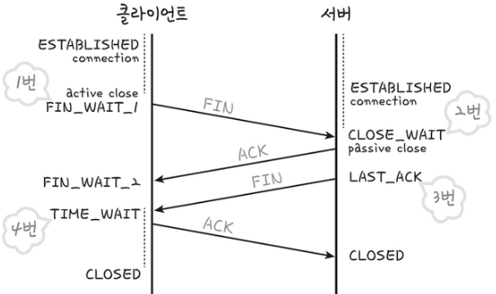

- 1번: 먼저 클라이언트가 연결을 닫으려고 할 때 FIN으로 설정된 세그먼트를 보냅니다. 그리고 클라이언트는 FIN_WAIT_1 상태로 들어가고 서버의 응답을 기다립니다.

- 2번: 서버는 클라이언트로 ACK라는 승인 세그먼트를 보냅니다. 그리고 CLOSE_WAIT 상태에 들어갑니다. 클라이언트가 세그먼트를 받으면 FIN_WAIT_2 상태에 들어갑니다.

- 3번: 서버는 ACK를 보내고 일정 시간 이후에 클라이언트에 FIN이라는 세그먼트를 보냅니다.

- 4번: 클라이언트는 TIME_WAIT 상태가 되고 다시 서버로 ACK를 보내서 서버는 CLOSED 상태가 됩니다. 이후 클라이언트는 어느 정도의 시간을 대기한 후 연결이 닫히고 클라이언트와 서버의 모든 자원의 연결이 해제됩니다.  
>**TIME-WAIT**  
Server로부터 FIN을 수신하더라도 소켓이 바로 소멸되지 않고 일정시간(default 우분투:60초, 윈도우: 240초)동안 세션을 남겨놓고 잉여 패킷을 기다리는 과정  
>- 지연 패킷 발생 대비, 패킷이 뒤늦게 도달하고 이를 처리하지 못한다면 데이터 무결성 문제 발생
>- 두 장치의 연결이 닫혔는지 확인, 만약 LAST_ACK 상태에서 닫히게 되면 다시 새로운 연결을 하려고 할 때 장치는 줄곧 LAST_ACK로 되어있기 때문에 접속 오류 발생        

### 인터넷 계층
장치로부터 받은 네트워크 패킷을 IP 주소로 지정된 목적지로 전송하기 위해 사용되는 계층.
- IP(Internet Protocol) : 비신뢰성, 비연결지향 데이터그램 프로토콜

- ARP(Address Resolution Protocol) : 주소변환 프로토콜, IP주소를 MAC주소로 변환하는 프로토콜

- RARP(Reverse ARP) : 반대로 MAC주소로 IP주소를 찾는 프로토콜

- ICMP(Internet Control Message Protocol) : 상태 진단 메시지 프로토콜, ping이 대표적인 프로그램

- IGMP(Internet Group Message Protocol) : 멀티캐스트용 프로토콜

 상대방이 제대로 받았는지에 대해 보장하지 않는 비연결형적인 특징을 가진다.

 ### 링크 계층  
 전선, 광섬유, 무선 등으로 실질적으로 데이터를 전달하며 장치 간에 신호를 주고받는 '규칙'을 정하는 계층, 네트워크 접근 계층이라고도 한다. 

 **유선 LAN(IEEE802.3)**  
 유선 LAN을 이루는 이더넷은 IEEE802.3이라는 프로토콜을 따르며 전이중화 통신을 씁니다. 

**전이중화 통신**  
 양쪽 장치가 동시에 송수신할 수 있는 방식을 말합니다. 이는 송신로와 수신로로 나눠서 데이터를 주고받으며 현대의 고속 이더넷은 이 방식을 기반으로 통신하고 있다.  

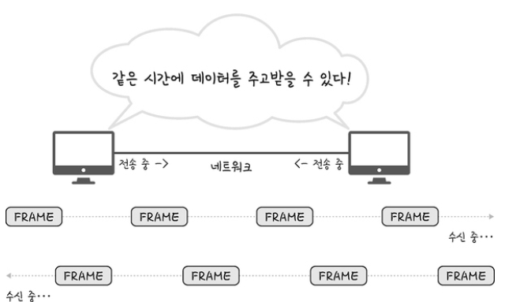

**CSMA/CD**  
참고로 이전에는 유선 LAN에 '반이중화 통신' 중 하나인 CSMA/CD 방식을 썼다. 이 방식은 데이터를 '보낸 이후' 충돌이 발생한다면 일정 시간 이후 재전송하는 방식을 말한다. 

### 유선 LAN을 이루는 케이블  
TP 케이블이라고 하는 트위스트 페어 케이블과 광섬유 케이블이 대표적

**트위스트 페어 케이블**  
트위스트 페어 케이블은 하나의 케이블처럼 보이지만 실제로는 여덟개의 구리선을 두 개씩 꼬아서 묶은 케이블을 지칭한다.
케이블은 구리선을 실드 처리하지 않고 덮은 UTP 케이블과 실드 처리하고 덮은 STP로 나눠진다. 

**광섬유 케이블**  
레이저를 이용해서 통신하기 때문에 장거리 및 고속 통신이 가능하다. 보통 100Gbps의 데이터를 전송하며 다음 그림처럼 광섬유 내부와 외부를 다른 밀도를 가지는 유리나 플라스틱 섬유로 제작해서 한 번 들어간 빛이 내부에서 계속적으로 반사하며 전진하여 반대편 끝까지 가는 원리를 이용한 것이다.

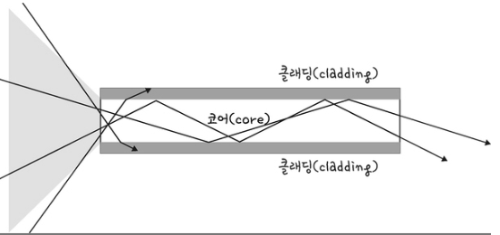

빛의 굴절률이 높은 부분을 코어라고 하며 낮은 부분을 클래딩이라고 한다.

**무선 LAN(IEEE802.11)**  
무선 LAN 장치는 수신과 송신에 같은 채널을 사용하기 때문에 반이중화 통신을 사용한다.

**반이중화 통신**  
양쪽 장치는 서로 통신할 수 있지만, 동시에는 통신할 수 없으며 한 번에 한 방향만 통신할 수 있는 방식을 말한다.  
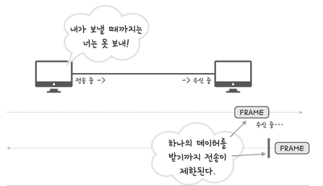  

**CSMA/CD**  
반이중화 통신 중 하나로 장치에서 데이터를 보내기 전에 캐리어 감지 등으로 사전에 가능한 한 충돌을 방지하는 방식을 사용
1. 데이터를 송신하기 전에 무선 매체를 살핀다
2. 캐리어 감지: 회선이 비어 있는지를 판단
3. IFS:랜덤 값을 기반으로 정해진 시간만큼 기다리며, 만약 무선 매체가 사용 중 이면 점차 그 간격을 늘려가며 기다린다.
4. 이후에 데이터를 송신한다.

**무선 LAN을 이루는 주파수**  
무선 LAN은 무선 신호 전달 방식을 이용하여 2대 이상의 장치를 연결하는 기술 

**와이파이**  
전자기기들이 무선 LAN 신호에 연결할 수 있게 하는 기술로 이를 사용하려면 무선 접속장치 (AP)가 있어야 한다. 이를 통해 유선 LAN에 흐르는 신호를 무선 LAN 신호로 바꿔주어 무선 인터넷을 사용할 수 있게 된다. 무선 LAN을 이용한 기술로는 지그비, 블루투스 등이 있다.  

**BSS**  
기본 서비스 집합을 의미하며, 단순 공유기를 통해 네트워크에 접속하는 것이 아닌 동일 BSS 내에 있는 AP들과 장치들이 서로 통신이 가능한 구조를 말한다. 근거리 무선통신을 제공하고, 하나의 AP만을 기반으로 구축이 되어 있어 사용자가 한 곳에서 다른 곳으로 자유롭게 이동하며 네트워크에 접속하는 것을 불가능하다.

**ESS**  
하나 이상의 연결된 BSS 그룹이다. 장거리 무선 통신과 BSS보다 더 많은 가용성과 이동성을 지원한다. 즉, 사용자는 한 장소에서 다른 장소로 이동하면 중단 없이 네트워크에 계속 연결할 수 있다.
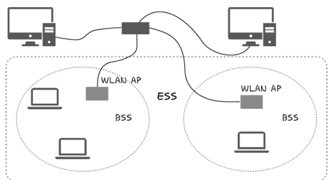 

### 이더넷 프레임  
데이터 링크 계층은 이더넷 프레임을 통해 전달받은 데이터의 에러를 검출하고 캡슐화하며 다음과 같은 구조를 가진다
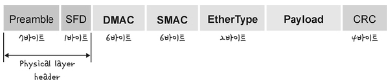  

- **Preamble** : 이더넷 프레임이 시작임을 알린다
- **SFD** : 다음 바이트부터 MAC 주소
- **DMAC,SMAC** : 수신, 송신 MAC주소를 말합니다
- **EntryTYPE** : 데이터 계층 위의 계층인 IP 프로토콜을 정의한다. ex) IPv4, IPv6
- **Payload** : 전달받은 데이터
- **CRC** : 에러 확인 비트

> **MAC 주소**  
> 컴퓨터나 노트북 등 각 장치에는 네트워크에 연결하기 위한 장치(LAN 카드)가 있는데, 이를 구별하기 위한 식별번호를 말한다. 6바이트(48비트) 로 구성

## 계층 간 데이터 송수신 과정  
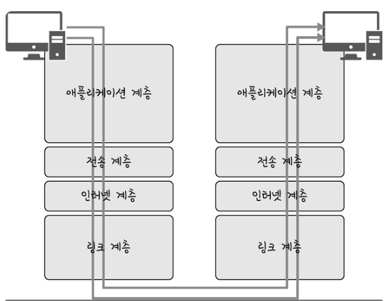
애플리케이션 계층에서 전송 계층으로 필자가 보내는 요청 값들이 캡슐화 과정을 거쳐 전달되고, 다시 링크 계층을 통해 해당 서버와 통신을 하고, 해당 서버의 링크 계층으로부터 애플리케이션까지 비캡슐화 과정을 거쳐 데이터가 전송된다.

### 캡슐화 과정  
상위 계층의 헤더와 데이터를 하위 계층의 데이터 부분에 포함시키고 해당 계층의 헤더를 삽입하는 과정
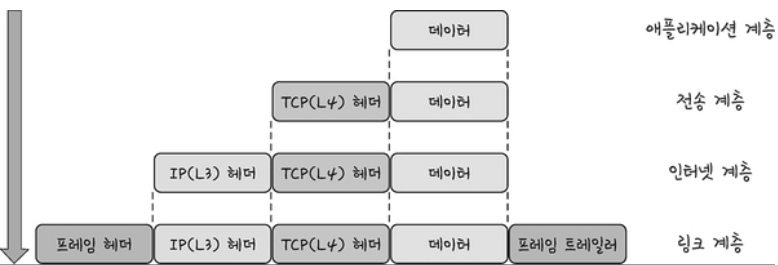 
애플리케이션 계층의 데이터가 전송 계층으로 전달되면서 ‘세그먼트’ 또는 데이터그램화 되며 TCP(L4) 헤더가 붙고, 인터넷 계층으로 가면서 패킷화되며, 이후 링크 계층으로 전달되면서 프레임화 된다.

### 비캡슐화 과정  
비캡슐화 과정은 하위 계층에서 상위 계층으로 가며 각 계층의 헤더 부분을 제거하는 과정을 말한다. 
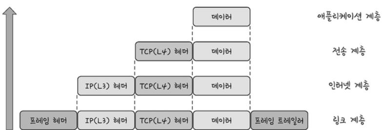 
이렇게 캡슐화된 데이터를 받게 되면 링크 계층에서부터 타고 올라오면서 프레임화된 데이터는 다시 패킷화를 거쳐 세그먼트, 데이터그램화를 거쳐 메시지화가 되는 비캡슐화 과정이 일어난다. 그 이후 최종적으로 사용자에게 애플리케이션의 PDU인 메시지로 전달된다.

## 2.2.2 PDU
네트워크의 어떠한 계층에서 계층으로 데이터가 전달될 때 한 덩어리의 단위를 PDU라고 한다. 

PDU는 제어 관련 정보들이 포함된 '헤더', 데이터를 의미하는 '페이로드'로 구성
- 애플리케이션 계층 : 메시지
  - ex) HTTP의 헤더가 문자열
- 전송 계층 : 세그먼트(TCP), 데이터그램(UDP)
- 인터넷 계층 : 패킷
- 링크 계층 : 프레임(데이터 링크 계층), 비트(물리 계층)